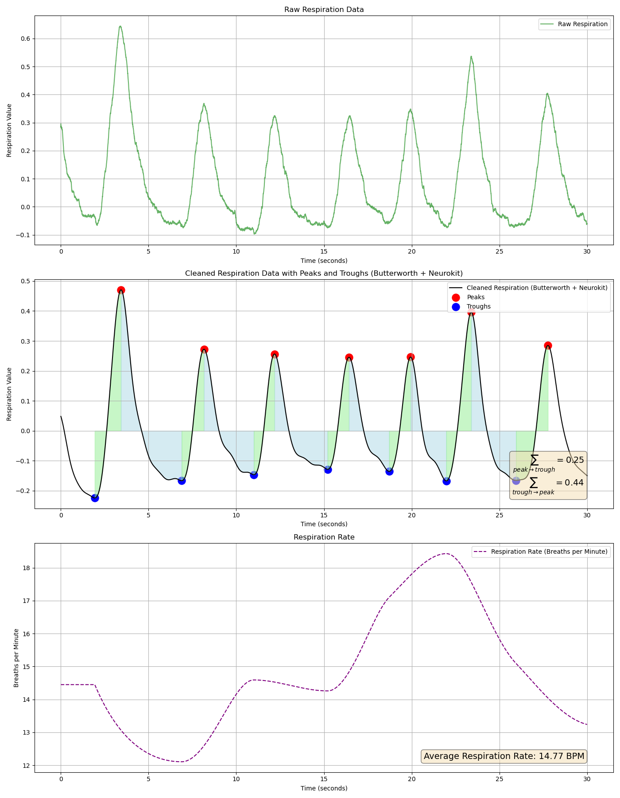
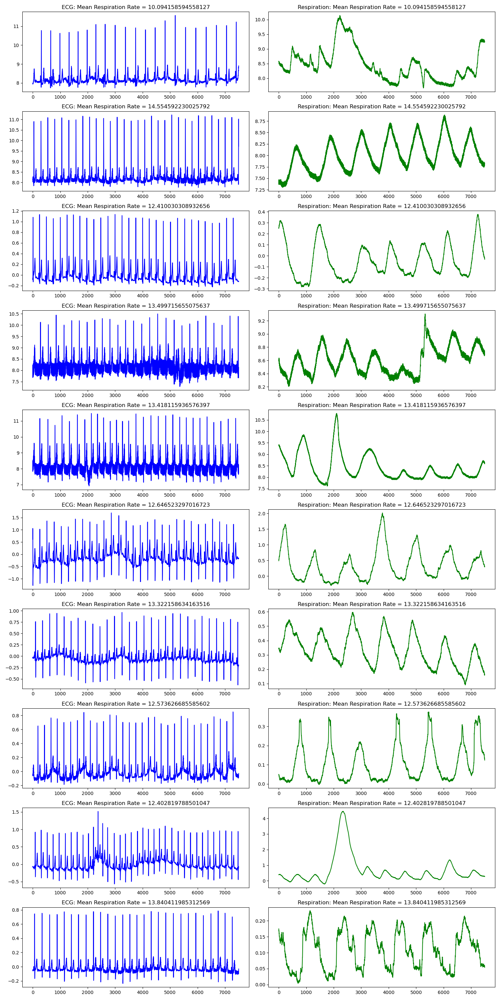

# ECG-Based-Respiratory-Predictions

This project focuses on developing and evaluating a multi-output model to predict multiple physiological metrics from ECG signal data. The primary metrics include `Mean Respiration Rate`, `Total Area Peak to Trough`, and `Total Area Trough to Peak`. The primary goals include preprocessing the data, training the model, and visualizing the results to understand the model's performance.

## Project Structure
- `data/`: Contains raw and cleaned datasets. **Notice**: the dataset folder is empty. You can download the dataset [here](https://www.kaggle.com/datasets/lana0038/fantasia-dataset-with-ecg-and-respiration-signals?resource=download)
- `notebooks/`: Contains the main Jupyter notebook for the project.
- `notebooks/ecg_respiratory_analysis_and_generate_preprocessing.ipynb`: include 3 python script into one notebook of `initial_data_EDA.py`, `generate_preprocessing_data.py` and `simple_mlp_model_build.py`
- `notebooks/model_build.ipynb`: same as `model_build.py`
- `notebooks/preprocessing_EDA.ipynb`: same as `preprocessing_EDA.py`
- `scripts/`: Python scripts for data preprocessing, model training, and evaluation.
- `scripts/initial_data_EDA.py`: Read the raw data and generated figures for analysis
- `scripts/generate_preprocessing_data.py`: Generate `fantasia_dataset_preprocessing.plk`, sanitized and cut data into samples ready for training.
- `scripts/preprocessing_EDA.py`: Generated figures for analysis on `fantasia_dataset_preprocessing.plk` sample.
- `scripts/simple_mlp_model_build.py`: read `fantasia_dataset_preprocessing.plk`, and build sequential MLP for inital baseline and validating.
- `scripts/model_build.py`: read `fantasia_dataset_preprocessing.plk`, and build multiple deep learning model (CNN + LSTM). Training and testing
- `scripts/model_grid_search.py`: Perforam grid search.py
- `output/`: Contains plots and figures illustrating the model's performance.


## Getting Started


### File included:

### Prerequisites

Ensure you have the following packages installed:
- numpy
- pandas
- scikit-learn
- matplotlib
- seaborn
- tensorflow
- PyWavelets
- seaborn
## Example Figure

The figure `peaks_throughs.png` illustrates how the peaks and troughs are calculated.



The figure `samples_example.png` showed the samples that use for training.



You can install the necessary packages using:

```bash
pip install -r requirements.txt

## Contact

-For any questions or inquiries, feel free to reach out via email: murat.kucukosmanoglu@dprime.ai.
Please do not hesitate to contact me if you have any feedback or need assistance with using the script.