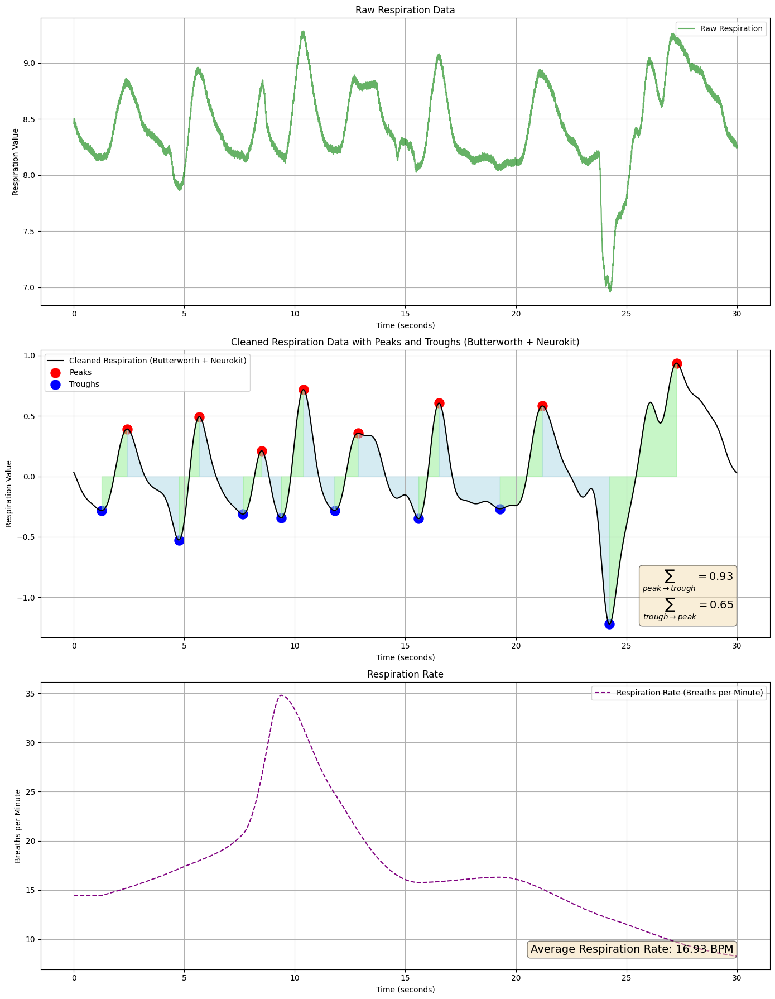

# ECG-Based-Respiratory-Predictions

This project focuses on developing and evaluating a multi-output model to predict multiple physiological metrics from ECG signal data. The primary metrics include `Mean Respiration Rate`, `Total Area Peak to Trough`, and `Total Area Trough to Peak`. The primary goals include preprocessing the data, training the model, and visualizing the results to understand the model's performance.

## Project Structure

- `data/`: Contains raw and cleaned datasets.
- `notebooks/`: Contains the main Jupyter notebook for the project.
- `scripts/`: Python scripts for data preprocessing, model training, and evaluation.
- `results/`: Contains plots and figures illustrating the model's performance.

## Getting Started

### Prerequisites

Ensure you have the following packages installed:
- numpy
- pandas
- scikit-learn
- matplotlib
- seaborn
- tensorflow

## Example Figure

The figure `peaks_throughs.png` illustrates how the peaks and troughs are calculated.



You can install the necessary packages using:

```bash
pip install -r requirements.txt

## Contact

-For any questions or inquiries, feel free to reach out via email: murat.kucukosmanoglu@dprime.ai.
Please do not hesitate to contact me if you have any feedback or need assistance with using the script.