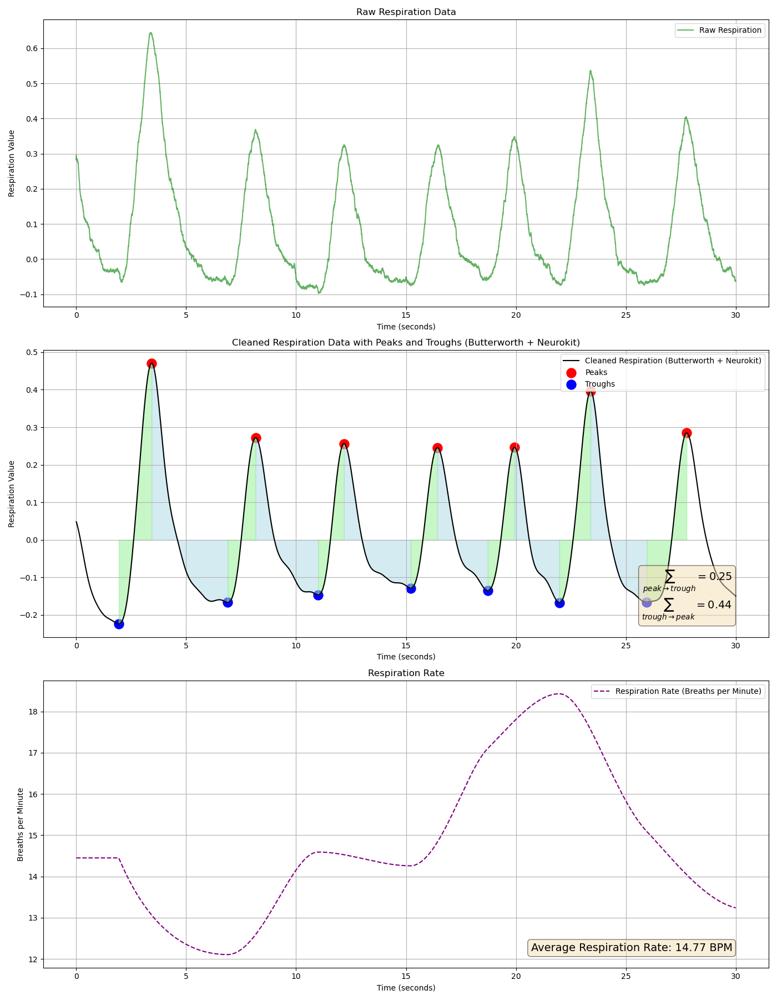
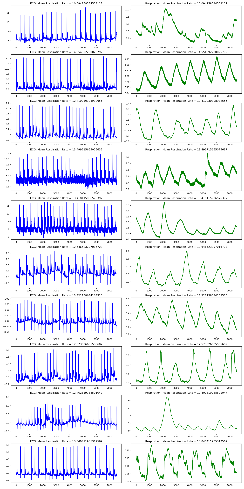

# ECG-Based Respiratory Predictions

A multi-output deep learning model that predicts respiratory physiological metrics directly from ECG signals. The model targets five outputs: mean respiration rate, trough-to-peak area, peak-to-trough area, and the corresponding latency measurements for each.

## How It Works

The pipeline has three stages:

1. **EDA** (`initial_data_EDA.py`) — loads the raw Fantasia dataset, resamples from 333 Hz to 250 Hz, applies Butterworth filtering, and visualises ECG/respiration signal pairs with detected peaks and troughs.
2. **Preprocessing** (`generate_preprocessing_data.py`) — segments signals into 30-second chunks, extracts 13 time-domain and statistical features per chunk (heart rate, HRV, SNR, respiration metrics), applies z-score quality control, and saves a pickled DataFrame.
3. **Model training** (`model_build.py`) — loads the preprocessed pickle, normalises ECG signals and hand-crafted features, computes db4 wavelet decompositions, and trains a three-input CNN-LSTM model with subject-stratified splits (70 / 15 / 15).

## Project Structure

```
ECG-based-respiratory-predictions/
├── dataset/              # Empty — download separately (see below)
├── notebooks/
│   ├── ecg_respiratory_analysis_and_generate_preprocessing.ipynb
│   ├── model_build.ipynb
│   └── preprocessing_EDA.ipynb
├── scripts/
│   ├── initial_data_EDA.py
│   ├── generate_preprocessing_data.py
│   ├── preprocessing_EDA.py
│   ├── simple_mlp_model_build.py
│   ├── model_build.py
│   └── model_grid_search.py
├── output/               # Generated plots and figures
├── requirements.txt
└── README.md
```

## Getting Started

### 1. Install dependencies

```bash
pip install -r requirements.txt
```

### 2. Download the dataset

Download the [Fantasia Dataset](https://www.kaggle.com/datasets/lana0038/fantasia-dataset-with-ecg-and-respiration-signals?resource=download) from Kaggle and place the files inside the `dataset/` folder.

### 3. Run the pipeline

```bash
# Exploratory data analysis on raw signals
python scripts/initial_data_EDA.py

# Generate the preprocessed pickle used for training
python scripts/generate_preprocessing_data.py

# EDA on the preprocessed samples
python scripts/preprocessing_EDA.py

# Train the baseline MLP
python scripts/simple_mlp_model_build.py

# Train the full CNN-LSTM model
python scripts/model_build.py
```

Outputs (loss curves, scatter plots, sample waveforms) are written to `output/`.

## Model Architecture

The final model (`create_3_input_model_5_output`) takes three parallel inputs:

| Input branch | Description |
|---|---|
| Time-domain ECG | Normalised raw signal → stacked CNN + Bidirectional LSTM |
| Wavelet domain | db4 decomposition (level 4) → CNN + Bidirectional LSTM |
| Hand-crafted features | `hr_min`, `hr_mean`, `hr_max`, `hrv`, `snr` (normalised) |

The branches are concatenated and passed to a shared dense head with five linear outputs. Loss is a weighted combination of Huber losses; the respiration rate output is weighted 5× relative to the area/latency outputs.

## Example Figures

Peak and trough detection used to derive respiration labels:



Sample ECG/respiration pairs used for training:



## Contact

For questions or feedback: murat.kucukosmanoglu@dprime.ai
